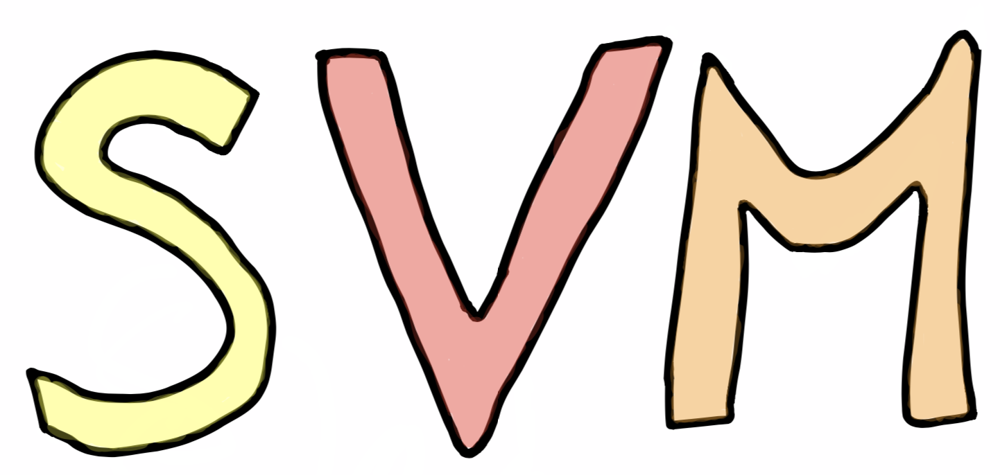

[](https://travis-ci.org/spacemeshos/svm)
[](https://codecov.io/gh/spacemeshos/svm)
[](https://github.com/spacemeshos/svm/blob/master/LICENSE)
[](https://gitter.im/spacemesh-os/svm)

_Spacemesh_ Virtual Machine


### Project Goals
* Self-contained. Should be hosted by the [Spacemesh Golang full-node](https://github.com/spacemeshos/go-spacemesh) and future _Spacemesh_ Rust full-node
* Built on top of [wasmer](https://wasmer.io)
* Future compatible for the _SMESH_ programming-language (the language is still in a research stage).


### Rust
`SVM` depends on the single-pass compiler of `wasmer` which requires the `rust nightly` release channel.
More information about installing `rust nightly` can be [found here](https://doc.rust-lang.org/1.2.0/book/nightly-rust.html)


### Build & Tests
The `SVM` project is organized into a couple of crates.
The root crate is called `SVM` and it's a workspace crate.

In order to build the `SVM` project crates at once and run their tests:
```rust
cargo +nightly build
RUST_TEST_THREADS=1 cargo +nightly test --all
```

If you want to build & test in release mode execute:
```rust
cargo +nightly build --release
RUST_TEST_THREADS=1 cargo +nightly test --all --release
```

Note: since `leveldb` and `rocksdb` can't have parallel isolated connections to the same database (directory).
That's why we ask `cargo` to run the tests serially (`RUST_TEST_THREADS=1`).


### Docker
In order to build the Docker image
```
docker build -t svm-build .
```

Then, for spawning a new container
```
docker run -it svm-build
```

### Roadmap
* [x] Infrastructure (see the [SVM article](https://medium.com/spacemesh/svm-446b106025bd))
* [ ] Gas metering
* [ ] App-to-App calls
* [ ] Storage Data-Structures
  * [ ] Array
  * [ ] List
  * [ ] Hash
  * [ ] Set
  * [ ] Sorted-Set
  * [ ] Strings
* [ ] Events with expiration
* [ ] App dependencies

### Supported Operating-Systems
* [x] Mac
* [x] Linux
* [ ] Windows

### Got Questions?
- If you'd like to contribute to _SVM_ or have questions please go to [SVM gitter channel](https://gitter.im/spacemesh-os/svm)
- Introduce yourself and ask anything on the [spacemesh gitter channel](https://gitter.im/spacemesh-os/svm).
- DM [@teamspacemesh](https://twitter.com/teamspacemesh)
